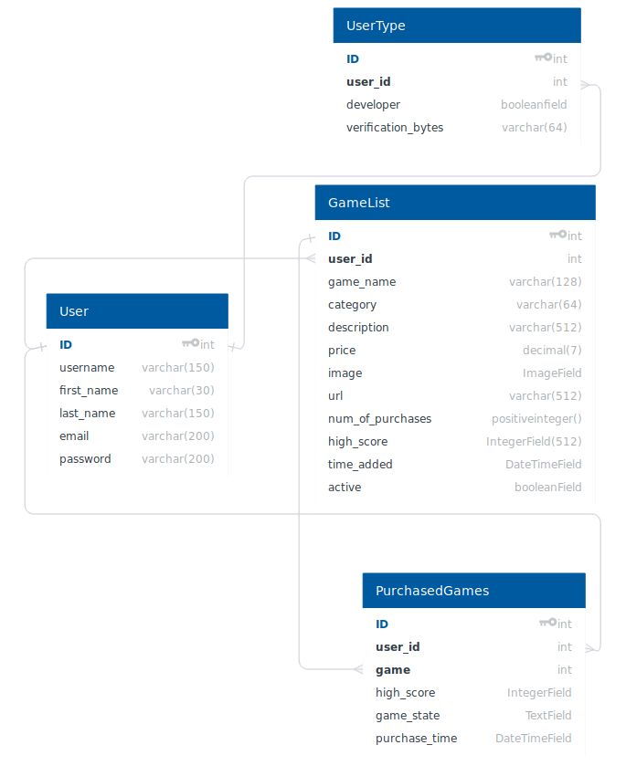

Game Project - Django
-----------------------
It is a course group project under a course Web Software Development in Aalto University. It includes the following features:


#### 1 Implementation
The Project includes the following details.

##### 1.1 Authentication
The plan is to implement the basic functional requirements inluding Django User Registration and Login and identifying user as Player or Developer. Having the basic functionality would help other participants to use the authentication system and develop their functionalities over authentication. Then email verification would be incorporated. After implementing the basic functionalities, 3rd party login would be added to the system. 3rd party login utilizes django-social-auth.

Enabling social media sharing is the later step. For implementing the functionality of “authentication”, django’s internal authentication and session management feature will be used. A table would be added for mapping users with roles (Developer or Player). Additional checks would ensure that the user having the necessary permission is accessing a url for e.g When players are trying to play an unpurchased game an error would occur.

But permissions for accessing resources would be mostly handled in each section separately by the programing participant.

##### 1.2 Basic player functionalities
Players can purchase additional games available on the service. The mockup payment system provided by Aalto (http://payments.webcourse.niksula.hut.fi/) is used for these transactions. Whena game is purchased, an entry is added to the PurchasedGames list to keep track of owned games.

For ensuring that only owned games can be played, the user ID of a player is used to look up the list of games owned by the player from the PurchasedGames table. By doing this, the service can ensure that only owned games can be accessed by players.

The PurchasedGames table is also where personal high scores are stored and the saved game states are also stored in another entry in this table. The saved states will store the gamestate attribute of SAVE messages in a text field.

A search is provided for finding new games. Also, the service automatically recommends new games based on the type of games (categories) already owned.

There is a view for seeing all games that a player owns as a kind of list or table.

A common view is used for playing all games, which is customized according to the SETTING message sent from the game to the service.

Another view is also provided as a sort of store page with a short description, the category and the price tag for the game is shown. This view is also used to init the purchasing process of a new game.

##### 1.3 Basic developer functionalities
Developer part would start after the user has authenticated himself to Django Login session management. The first step is to confirm is the User is a developer using the information stored in UserType model. After confirmation, the user would be allowed to add games, modify existing games, delete a game and check the popularity of his game by checking the number of purchases. 

A permission management would be added to ensure if the user is only able to modify games that he has added and is unable to access the games of other developers. Also the names of games should be unique.

Addition, modification and deletion of game would be handled by Django Forms. As an implementation of REST API, these functions would be handled through REST requests. Authentication handling in REST is yet needs to be searched.

### 2 Schematics



#### 3 Deployment and usage
To run the server use the following procedure. First clone the directory:<br/>
```
$ git clone https://github.com/hassaanuah/Django_Gamestore_Application.git

```
Enter the directory and run the installation file.<br/>
```
$ cd Django_Gamestore_Application/
Django_Gamestore_Application$ sudo bash install.sh
```
Now to run the server use the following command:<br/>
```
$ cd Django-Gamestore/
Django_Gamestore_Application$ cd game_project
Django_Gamestore_Application/game_project$ python3 manage.py runserver
```
Remember that you would also need to create API key and client secret from Twitter and Github to use oauth.
<br/>


There are two pre-made accounts available:<br/>
Player account<br/>
Username: player<br/>
Password: player

Developer account<br/>
Username: developer<br/>
Password: developer

Uploading games to the store requires registering as a developer.<br/>
Playing and purchasing games requires registering as a player (non-developer).

Additional player and developer accounts can be created from the register page.


#### Authentication
The system provides the option to Login, Logout and register as player and developer. Also when a user registers himself, he receives a mail on his entered email address to confirm his account. After activate the account is set to active state.

#### Basic player functionalities
The player is able to buy game from the gamestore if the game is set to active by developer. Payment is handled by payment system of niksula. The player can only play the game which he has bought through a check which confirms if the player has purchased the game. There is a search option from where the players can search for the game. Games list can be sorted on basis of Title, Genre, Popularity etc. A search field is also present to search for the game. Finally, the store also recommends other similar games based on the genre of the currently viewed game.

#### Basic developer functionalities
Developer is able to add a game in which he selects a game name, price, description, genre, URL of game and an image to show with game. The player can edit details of games. Also he can deactivate games after which the game would not be accessible in game store and only the players who have purchased the game would be able to play it. Developer can set the game to active again so now it will again be searchable in gamestore. If the game has been purchased by any user, then the player would not be able to delete it but the game will be set to inactive state so that player can always play the game. Also the game shows the time when it was added in the gamestore.

Also the system stores personal highscore and global highscore. Number of purchases are incremented on every purchase. Purchased table contains purchase time field which shows when the game has been purchased. There are additional checks which ensure that developer is only able to edit or modify his own games. This is done through filtering of games based on user's id and check if the game uploader is the same person who is currently logged in.

#### Game/service interaction
The service has a separate app called game_communicator which can be used to retrieve or store information for games of the currently authenticated user. Information is retrieved by using GET requests and updated by using POST requests.

The view which is responsible for allowing games to be played includes JavaScript which listens to events sent by the game frame and then reacts appropriately by sending a request to the game_communicator app.

#### Quality of Work
There are few apps which perform relevent functions for example there is an app that is game_server which is responsible for all basic tasks. Then a different app for controlling REST interface and communication between player and server.
Many of internal DJango features have been used like Django Auth, serialers for converting data to json etc. No django app is used as REST framework.

User experience has been given a considerable time and the website is in presentable condition but it does not give the feel of a full developed website because of immature frontend. Though the website contains almost all the functionalities but an attractive frontend is missing.

The project makes use of the UnitTest framework provided by Django.

Tests are used to ensure that all views produce valid HTML via html5lib. There are also unit tests for testing the custom functions of models and that authorization on crucial pages works correcrtly. The game communicator app also has unit tests for testing each of its methods.

In addition to unit tests, integration tests of sorts are provided which utilize Selenium and the Firefox webdriver. These test some common tasks such as logging in, purchasing a game, playing a game and editing game details.

ESLint was utilized to ensure consistent writing of JavaScript code. Pylint was also utilized to some extent in the most important files such as the views.py and models.py files.

#### Non-functional requirements
Project was planned initially and the tasks were divided. Majority of the major functional elements were done by Tommi. Most of the project was according to our schedule except the additional optional features.

The project is documented in the project plan and also contains the instructions for initial run of the project.

#### Save/load and resolution feature
The service stores the received messages as a string in the respective PurchasedGames entry. When a LOAD_REQUEST is received, this information is retrieved and parsed as JSON to pass it further to the game.

Furthermore, the view also listens to SETTINGS messages and sets the size of the iframe appropriately.

#### 3rd party login
3rd Party authentication has been implemented and user is able to login through Github and Twitter account. Social_Django module has been used for this implementation. After getting registered, the user is redirected to a page to select his account type, if he wants to register as a player or user.


#### RESTful API
A basic REST API has been implemented so that player can see some details of games present in game store. A developer can provide his credentials in the query and is able to see complete details of a game and can delete any of his uploaded game.

#### Own game
An own game was created using JavaScript and HTML5 canvas for graphics. It is a quite simple platformer game where the screen starts moving upward and the goal is to stay alive by not falling off the bottom of the screen. Each level lasts for 30 seconds and the speed at which the screen moves increases each level.

The game also supports full communication with the service. Score is automatically submitted when winning a level or when dying. Buttons for saving and loading are also provided. The game saves the current level number and the score the player had at the start of the level. Thus loading also takes one to the start of the level.

The game source code and other files are available in the static folder.

#### Mobile Friendly
The website can be opened in mobile phone and all the layout is usable. Though its not very fancy but still it is easy to use and understandable.


#### Social media sharing
All games are shareable on social media like facebook and twitter. The game contains the game name and a description of the game. For some reasons, images don't always load properly when sharing.


#### Additional Features:
If a user forgets his password, then he can recover his account by entering his username and an automated email will be sent on his email address for password reset

Also on the portal, a user can change his Firstname, lastname and can also change his password.

Developer can Active or Deactive his games. In case of Deactivation, the game would no more be searchable on the gamestore and will only be accessible to the uploader of the game (developer) and to the players who have purchased the game.


#### Run Server:


